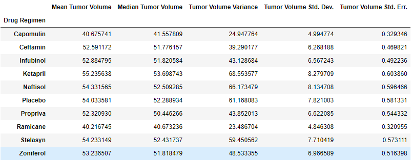
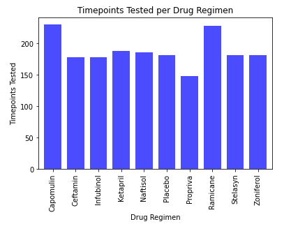
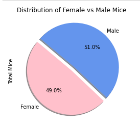
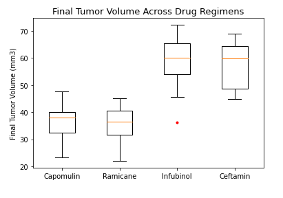
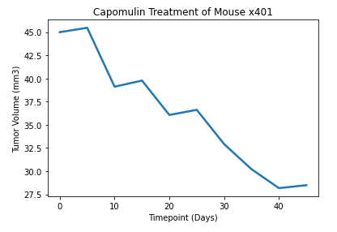
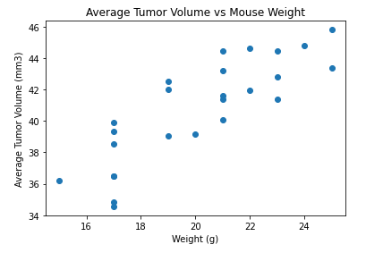
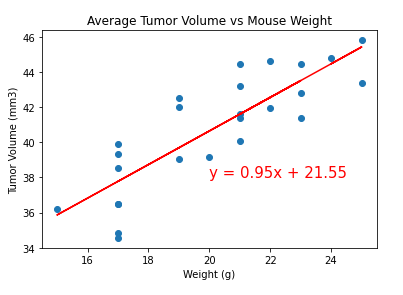

# matplotlib-challenge
## Module 5 Challenge

In this project I used Pandas and Jupyter Notebook to analyze a pharmaceutical drug used in an animal study in comparison to other treatment regimens. Click [here](https://github.com/isabellajade/matplotlib-challenge/blob/main/Pymaceuticals/pymaceuticals_starter.ipynb) to view the code.

## Summary of Study Results

Upon analyzing the data I discovered that the Capomulin treatment regimen and the Ramicane treatment regimen were similar in their summary statistics of their tumor volumes (mean, median, variance, standard deviation, and standard error). Capomulin and Ramicane also had a similar amount of timeoints tested, 230 and 228 respectively. As seen in the boxpot of the final tumor volumes Capomulin and Ramicane had similar final tumor volumes, with Ramicane being slightly smaller overall. 

## Summary Statistics Table
Included in this table are the mean, median, variance, standard deviation, and SEM of the tumor volume for each drug regimen.

## Bar Chart
Displayed in this bar chart is the total number of time points tested for all mice for each drug regimen throughout the study.

## Pie Chart
This pie chart represents the distribution of female versus male mice over the study for all drug regimens. 

## Box Plot
This box plot displays the distribution of the final tumor volume for all of the mice within treatment groups Capomulin, Ramicane, Infubinol, and Ceftamin. Potential outliers are represented by the red dot.

## Line Plot
Below is a line chart representing the tumor volume vs time point for a randomly selected mouse treated with Capomulin.

## Scatter Plot
This scatter plot displays the tumor volume vs mouse weight for mice treated with the Capomulin treatment regimen.

## Correlation and Regression
Below is the calculated correlation coefficient and linear regression model for mouse weight and average tumor volume for the Capomulin treatment regimen.

